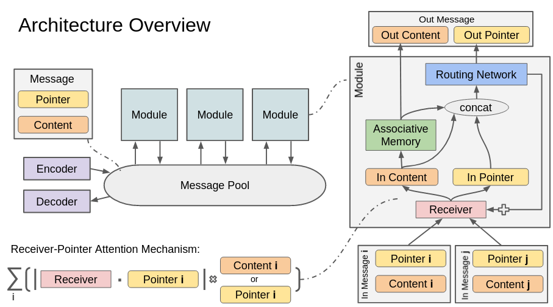

# sba
Semantic Bus Architecture - Recursive Routing Network

## Architecture Overview

Differentiable neural modules send and receive messages via a shared bus/pool. The modules can learn to integrate specific messages and send associated stored messages back over the bus to specific other modules based on a learned routing transformation.

Messages consist of pointers and contents. The modules receive and integrate messages based on the similarity between the modules receiver and the pointer of the messages. The modules use the contents of the integrated messages as the key for an associative memory matrix and output the corresponding value. They send this value as a new message content back to the bus with a pointer resulting from a transformation of the pointers and contents from the integrated messages.

More details in [this presentation](https://docs.google.com/presentation/d/1Mgoikm6qzNe08JA7fVkKAO-k5qa7Hnbsyndvd_ruk2s/edit?usp=sharing).

## Usage
Still work in progress. You can run the following command to run prototypical MNIST classification:

`python arch.py -train -classify --dataset mnist --modules 30`

